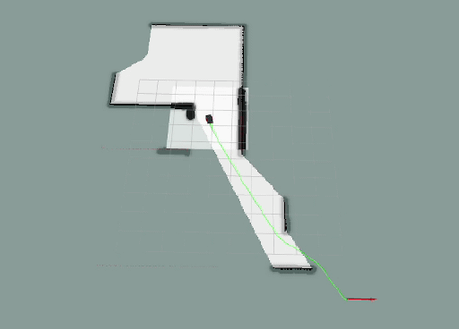
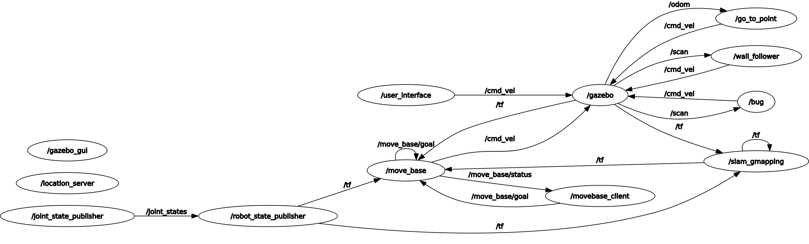

# Research Track 1: Final Assignment


---

# Outline
* ROS Package Description
    * What the Package Does
    * How the Nodes in the Package works
        * User Interface
        * Position Server
        * MoveBase Client 
        * Bug0 
        * How the nodes communicate (Computational Graph)
    * Possible improvements to the package
* How to Compile and launch the Package

# ROS Package Description

## What the Package Does
This package provides a 3D environment with a mobile robot, and a number of robot control is implemented to navigate this environment. The major packages and nodes that are showcased in this package are the MoveBase path planning package, the slam gmapping package for mapping the environment, and the bug0 node for implementing the bug0 motion planning algorithm. A command-line user interface is provided for the user to select one of the following actions 
1. Move to a Random position from one of the 6 possible positions.
2. Select one of the possible positions.
3. Start following external walls.
4. Stop in the last position. 
5. Change the planning Algorithm from Dijkstra to Bug0

There are 6 location listed as a possible targets for the robot to navigate to and based on the action selected between 1 or 2 a location will be set as a target location for the mobile robot to navigate to. There are two path planning algorithms implemented in this package, MoveBase Action(Dijkstra) and Bug0. MoveBase is the default algorithm for action one and two but if the user select action 5, the user gets to use the Bug0 Algorithm to navigate to the selected or chosen target just once and then it is set back to the default algorithm. The user also has the opportunity to make the mobile robot follow the external walls in the environment by selecting action 3, this action can be stopped by selecting action 4. Below shows a view of the behaviour of the mobile robot when action one is selected with the default path planning algorithm still set to MoveBase. 
<div align="center">

</div>

## How the nodes in the package works
A number of nodes work together to make this package work as prescribed, however, all this would not be possible without the custom service message that was created, so the description of the workings of the package would begin with the custom services that was created for the communication of the nodes. 

### Custom Services
Three service message was created, _RandomTarget, MoveBaseTarget and MoveBaseResult_
* __RandomTarget__ is a service message that helps to accept a random target request and send a response of the target that has been selected randomly from the list of possible positions. Code snippet below.
```srv
string status # This is the request message sent to the random position server
---
int8 cord_x # This is the response coordinates sent back to the user interface
int8 cord_y 
```
* __MoveBaseTarget__ is a service message that is used to send a request of the target position that should be reached by the robot to the movebase client. A boolean response is sent back to the user interface which is True when the robot is already at the new target that was sent and false otherwise. 
```srv
int8 cord_x # This is the requested coordinates sent to the movebase client 
int8 cord_y 
---
bool status 
```
* __MoveBaseResult__ is a service message that is used to request a response when the robot had reached the target goal. 
```srv
string status
---
string status 
```
### User Interface
The user interface is a command-line interface that queries the user as to what action they want the system to perform from the list of actions provided. The user interface is what connects all the nodes together, a number of service clients are implemented to connect with each of the nodes to set the required action to active. Two variables were created to make the switch in control easy and straightforward, *__pick and state__*

**pick** represents the value of the action that was selected by the user 

**state** represents the state of the system ie (*performing an action or prompting a user to enter an action*)

A variable **algo** was also implemented to make the switch between algorithm

### Position Server
The position server is a server that accept a request for target position and then selects one of the 6 possible location from the list and sends the selected position as a response. 
```python
TARGET_POSE = [(-4, -3), (-4, 2), (-4, 7), (5, -7), (5, -3), (5, 1)]

# Random Location selector
rand_index = rand(0, 5)
rand_x, rand_y = TARGET_POSE[rand_index]
print(f'The Target Location is x: {rand_x}, y: {rand_y}')
return RandomTargetResponse(rand_x, rand_y)
```

### MoveBase Client
The move base client is a node that accepts a target goal from the user interface and then sends the goal to the MoveBase server. It receives feedback of the current position from the movebase server and uses it to determine the distance to the target and then prints the output of this information on the screen. The move base client also monitors the movebase server to see if the goal has been succeded so as to send a response of **Target Reached** to the user interface and unblock the user interface. 
```python
if (client.get_state() == GoalStatus.SUCCEEDED):
    print("\nTarget Reached !!!\n")
    state = 0
```

### Bug0
The bug0 path planning algorithm is an algorithm that uses two mechanisms, go straight to point and follow the wall. The algorithm 
1. sets a straight path to the goal, 
2. moves the robot towards the goal through that path, 
3. if an obstacle is detected, follow the obstacle till the path to the goal is clear again 
4. go straight to the goal. 

For this algorithm, two nodes were implemented, go_to_point node and wall_follow node. 
a service message is used to connect the two nodes to the bug0 node. Based on the stage of the algorithm the state is at, the bug0 node either sets 
* the go_to_point node to active and wall_follow to not active
* the go_to_point node to not active and wall_follow to active
* the go_to_point node and the wall follow node to not active. 

```python
if state_ == 0:
    resp = srv_client_go_to_point_(True)
    resp = srv_client_wall_follower_(False)
if state_ == 1:
    resp = srv_client_go_to_point_(False)
    resp = srv_client_wall_follower_(True)
if state_ == 2:
    resp = srv_client_go_to_point_(False)
    resp = srv_client_wall_follower_(False)
    twist_msg = Twist()
    twist_msg.linear.x = 0
    twist_msg.angular.z = 0
    pub.publish(twist_msg)
    state_ = 4
```

### How the nodes communicates
Below is an rqt graph that shows the communication between the nodes that has just been described. 


## Possible Improvements to the Package
* The major improvement that would bring more life to this package is an upgrade to the user interface, the user interface would be a lot more user-friendly and intuitive if it were a graphical interface. **_An UPDATE is coming soon, with a User Interface provided by Jupyter Notebook which would have buttons to start each of these actions and select the type of algorithm to be used._**"
* Another improvement would be the ability to cancel the goal when it has started or to preempt the goal with another goal. This is quite possible with the movebase action server and would be implemented soon as well. 

# How to compile and Launch the package

## Compile

First you create a folder for your catkin workspace
```bash
mkdir -p ~/catkin_ws/src
```
Clone the package repository
```bash
cd ~/catkin_ws/src
git clone https://github.com/Omotoye/final_assignment.git
```
Once the package has been successfully cloned, you then build the workspace
```bash
cd ~/catkin_ws/
catkin_make
```
## Launch
The are two launch files to be launch, **simulation.launch** (*starts the already configured simulation and the movebase package*) and **final_assignment.launch** (*starts the movebase client and the bug0 launch file which contains go to point and wall follow nodes*).

Step one, source the setup.bash file, if you followed the steps above, then you can enter the command below. 
```bash
source ~/catkin_ws/devel/setup.bash
```
If you didnt follow the initial steps because you already have a workspace, trace a path from you home directory to your catkin workspace down to your setup.bash file. An Example is shown below, __*THIS WILL NOT WORK FOR YOU, IT IS JUST AN EXAMPLE TO SHOW HOW IT CAN BE DONE*__
```bash
source /home/omotoye/Desktop/catkin_ws/devel/setup.bash
```
run the command below to launch the simulation *you might see some warning messages __IGNORE THEM__*
```bash
roslaunch final_assignment simulation.launch 
```
run the command below to start all the nodes required for the robot control
```bash
roslaunch final_assignment final_assignment.launch 
```
run the command below to start the user interface node 
```bash
rosrun final_assignment user_interface.py
```
from here, follow the instructions given on the command line prompt


_**for more information about the python scripts [Click Here](https://omotoye.github.io/final_assignment/ "Webpage for the Docs of the script")**_
